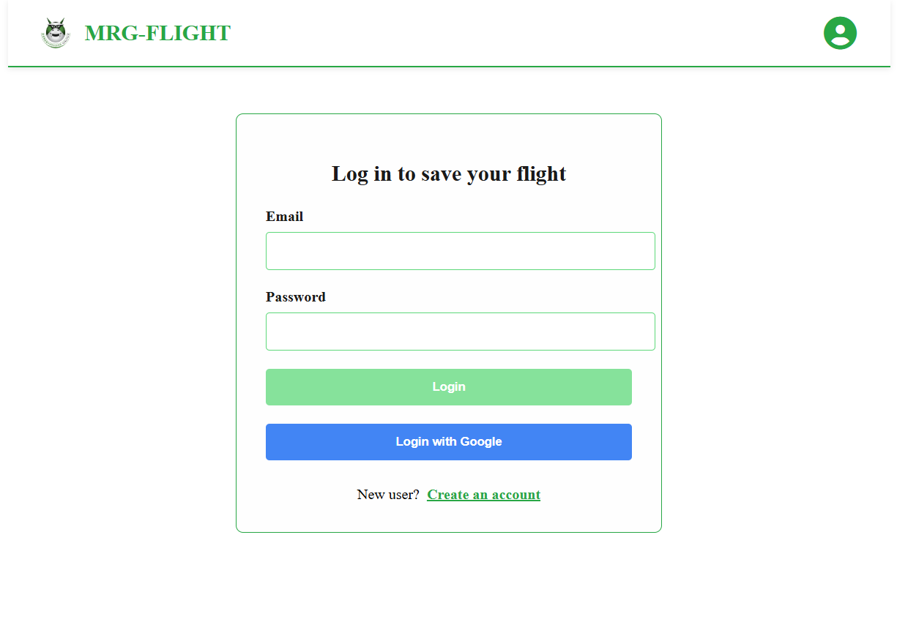
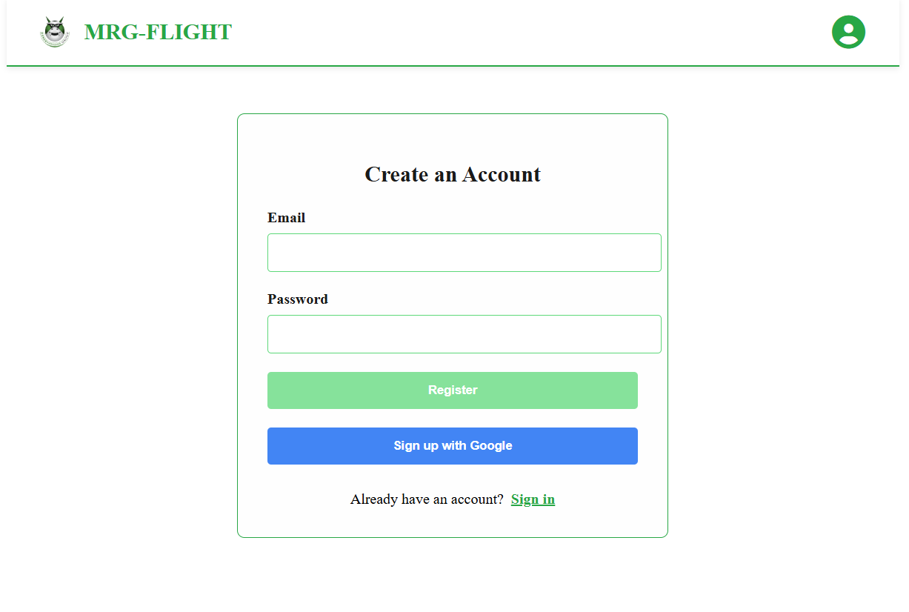
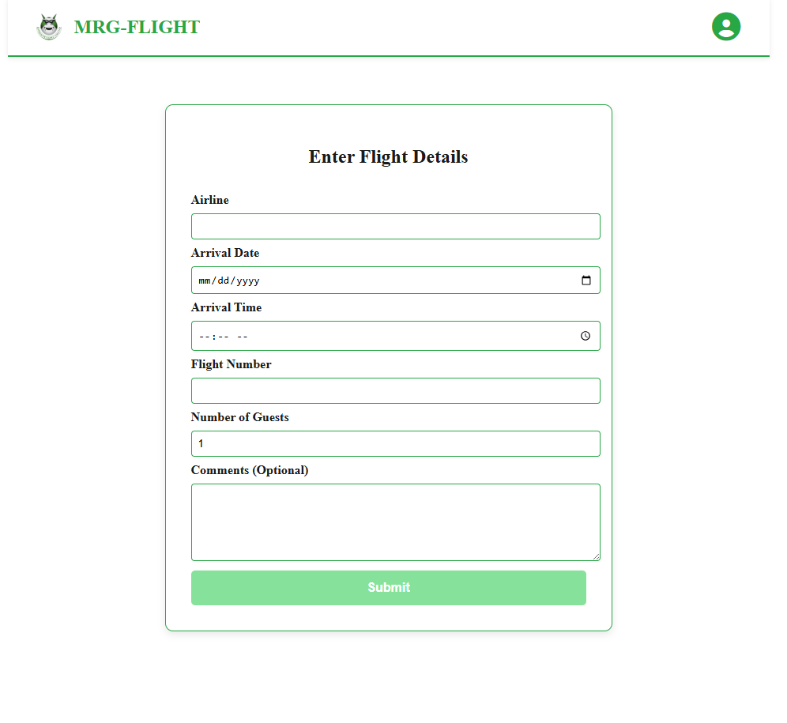
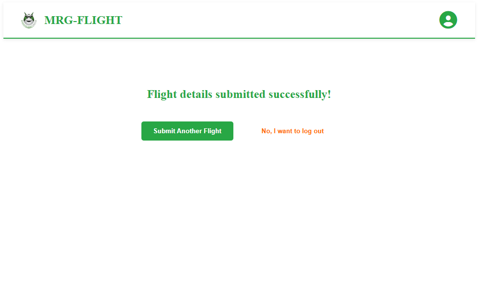

# ✈️ MRG Flight App

This is a simple Angular application that allows users to submit their flight information. It's built with Angular 20 and Firebase, featuring authentication, form submission, and success confirmation.

🌐 **Live Demo:** [https://mrg-flight-71dc9.web.app/](https://mrg-flight-71dc9.web.app/)

---

## 🚀 Features

- 🔐 Firebase Authentication
- 📄 Flight information form (airline, flight number, guests, etc.)
- ✅ Success confirmation screen
- 🔓 Auth-guard protected routes
- 🔐 Logout functionality via profile icon
- 🎨 Responsive UI with SCSS theming
- 🌿 Font Awesome icons integration
- 🔧 Environment-based configuration

---

## 🖼️ Screenshots

### 🔐 Login Page



### 🔐 Register Page



### 🛫 Flight Form



### ✅ Success Page



---

## 🛠️ Tech Stack

- [Angular 20](https://angular.io/)
- [Firebase Authentication](https://firebase.google.com/products/auth)
- [Firebase Hosting](https://firebase.google.com/products/hosting)
- [Font Awesome](https://fontawesome.com/)
- [SCSS](https://sass-lang.com/)

---

## ⚙️ Environment Setup

Configure your environment variables in the appropriate files:

### `src/environments/environment.ts`

```ts
export const environment = {
  production: false,
  firebaseConfig: {
    apiKey: 'YOUR_DEV_API_KEY',
    authDomain: 'your-project.firebaseapp.com',
    projectId: 'your-project-id',
    storageBucket: 'your-project.appspot.com',
    messagingSenderId: 'your-sender-id',
    appId: 'your-app-id',
  },
  backend: {
    url: 'https://your-dev-backend-url.com',
    token: 'dev-token',
    candidate: 'Your Name',
  },
};
```

## 🧪 Local Development

Install dependencies:

```bash
npm install
```

Run the app in development mode:

```bash
ng serve
```

Test production build locally :

```bash
ng build --configuration=production
npx serve -s dist/mrg-flight/browser
```
